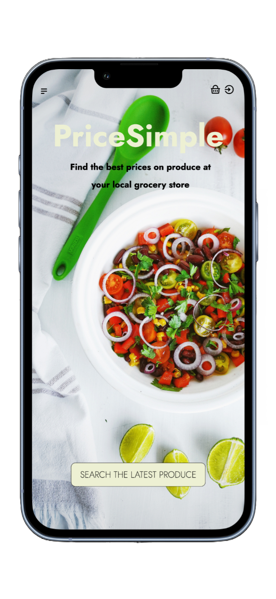

# PriceSimple
A website that compares prices of vegetables between grocery stores, as well as from week-to-week. 

STACK:
React, Node.js (Express), MongoDB, Puppeteer, Chart.js, styled-components, Auth0

BACKGROUND: 
I was interested in developing an accessible, easy-to-use website to help people save money, especially in light of the increasing cost of everyday goods and services. Given the complexity and sheer amount of grocery store data, I decided to start with fresh vegetables, because of the role they have improving health outcomes. (Really: who couldn't benefit from eating more veggies?)

OVERVIEW: 
Product data (price, package weight, image source, website link etc.) is retrieved through scraping grocery store websites using Puppeteer and stored in MongoDB. The current week's price data is fetched upon site load. Users can then search for and compare products. 

SELECTED FEATURES: 
- Search function, displaying all products matching the search term in a dropdown list;
- Search results page, which displays price, photo, and link to grocery store website for each result;
- Compare function, providing a graph that compares prices over the last 3 weeks for a specific product;
- User login via Auth0.

Additionally, users who have signed-up for an account have access to:
- Basket function, where users can store items that they are interested in. They prices in the basket will update weekly
- Profile page (still work-in-progress)

CHALLENGES + LESSONS:
The most challenging part of the project so far has been figuring out how to <b>retrieve and standardize the data</b>. 

<i>Retrieve</i>: Each grocery store website loads and navigates differently, e.g. load-on-scroll, pagination, language, modals. I had a good (and hard) time learning the Puppeteer syntax, and learned a lot about how large websites like the grocery store sites work. The learning continues: for example, although I was able to combine an automated scroll with scraping on a test website, I am still trying to figure it out for one of the actual grocery store sites.

<i>Standardize</i>: Some vegetables are measured by weight, others by package, and still others by item; as well, data is organized differently on each site. I had to make sure the data was consistent and standardized across the different sites, and that it could eventually be compared, arithmetically manipulated, and graphed (requiring a bit of Regex along the way).

Other than that, I am working on a few things: 
- currently, the data is scraped into a .json file, which then is imported into MongoDB. I would instead like to use Mongoose to push the data directly into Mongo;
- hosting the website so that it can be used!

NB: the back-end code is available here: https://github.com/matt-s-lee/PriceSimple-server. Mock-ups for mobile version created using https://previewed.app/